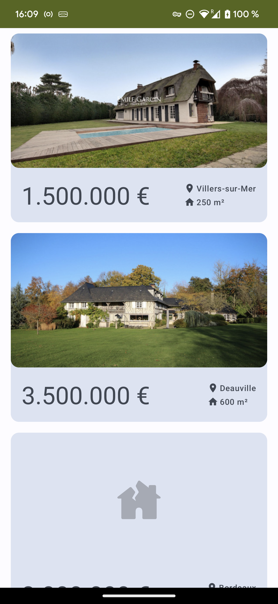
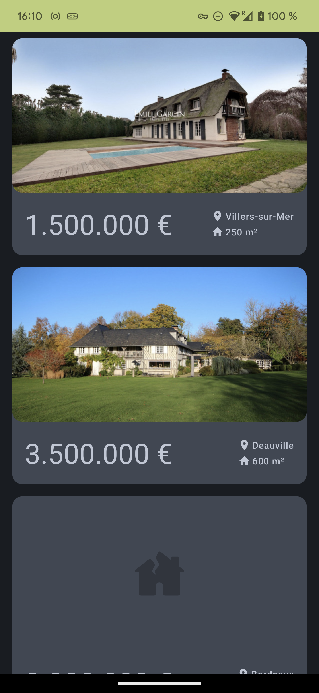
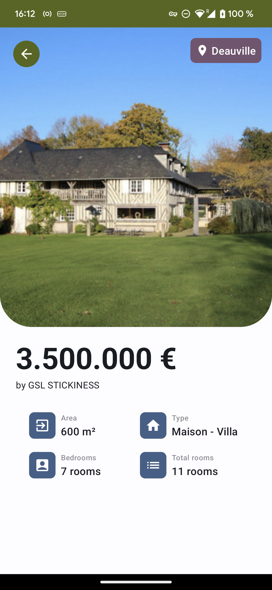
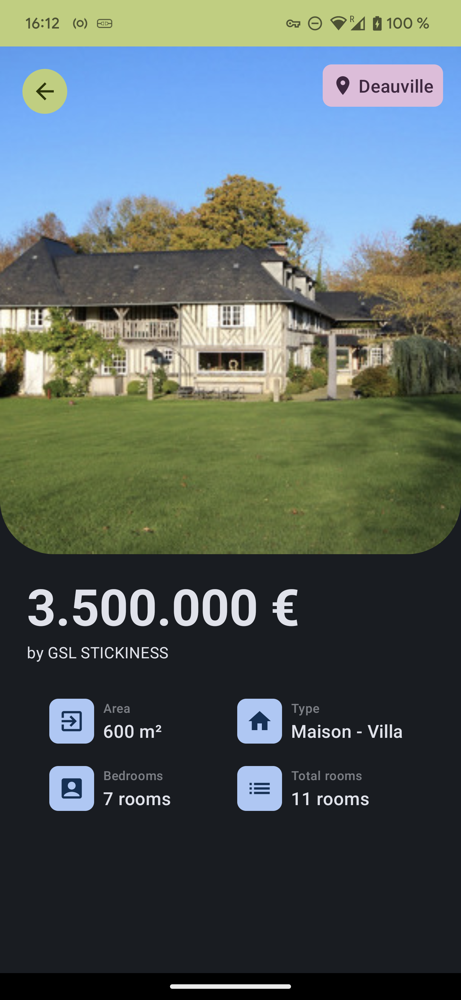

# RealStation

RealStation app displays a list of random real states from [this endpoint](https://gsl-apps-technical-test.dignp.com/listings.json).
Then if you click on one of these real states, a detail screen will show with extra information about the item clicked.

> GIF Source: [RealStation_Demo](readme_data/RealStation_Demo.mp4)
>

## Android Studio environment

This project was run on a latest stable version (as of today Sep 18, 2023): **`Android Studio Giraffe | 2022.3.1 Patch 1`**

## Getting Started

In the last week, I developed this nice app using the following tech stack:

- **100% Kotlin**
- **100% Jetpack Compose**
- Architecture: **MVI+UDF**, CLEAN, SOLID, Repository pattern...
- Jetpack Architecture Components
- Coroutines + Flows
- Retrofit
- Hilt - Dependency injection
- Material Design Components v3
- Version catalog with TOML file

### MVI-UDF Architecture
For this project I used the MVI(_Model-View-Intent_) + UDF(_Unidirectional Data Flow_) architecture.
This allows to handle easily different states of the UI holded by a `UIState` class. At the same time, the UDF pattern allows to simplify the management of actions(triggered on the UI) and events(emitted by the business logic).

### UI layer
First of all, the UI is written fully in Compose and strongly supported by a solid design system crafted by the **Material Design 3** library.
Thanks to that, create a consistent design, nice animations/transitions and a **dark theme** in parallel were able to achieve.

This project follows the *Single-Activity pattern*, where **`MainActivity.kt`** its the base Activity. 
From it we can differentiate 2 Composable screens:
  1. **`RealStateListScreen.kt`**: shows the list of real states. Each item in the list is modelled by `RealStateListItem`. It is supported by the **`RealStateListViewModel.kt`**, which exposes **`RealStateListUIState.kt`** and updates the UI.
  
 
  
  2. **`RealStateDetailsScreen.kt`**: shows the info details from the selected real state. The details are modelled by `RealStateDetails`. It is supported by the **`RealStateDetailsViewModel.kt`**, which exposes **`RealStateDetailsUIState.kt`** and updates the UI.
  
   

### Data layer

**`RealStateRepository.kt`** was created. It consumes from **`AvivAPI.kt`** using **Retrofit**.
This repository is then injected in both of the ViewModels to gather the necessary data.

## Conclusion 

### Resources
Find attach to the project folder a [debug APK](readme_data/RealStation_1.0(1)-debug.apk). Alternatively you can build the project using Android Studio.

In addition, a few screenshots and a demo video can be found also in the project folder: 
- [RealStation_Demo](readme_data/RealStation_Demo.mp4)
- [RealStations_RealStateListScreen_Light.png](readme_data/RealStations_RealStateListScreen_Light.png)
- [RealStations_RealStateListScreen_Dark.png](readme_data/RealStations_RealStateListScreen_Dark.png)
- [RealStation_RealStateListScreen_Light.png](readme_data/RealStation_RealStateListScreen_Light.png)
- [RealStation_RealStateListScreen_Dark.png](readme_data/RealStation_RealStateListScreen_Dark.png)

### Final words
I hope you could enjoy my work and could appreciate the effort in it.

Don't hesitate to ask any question if you have.
Have a nice day!
